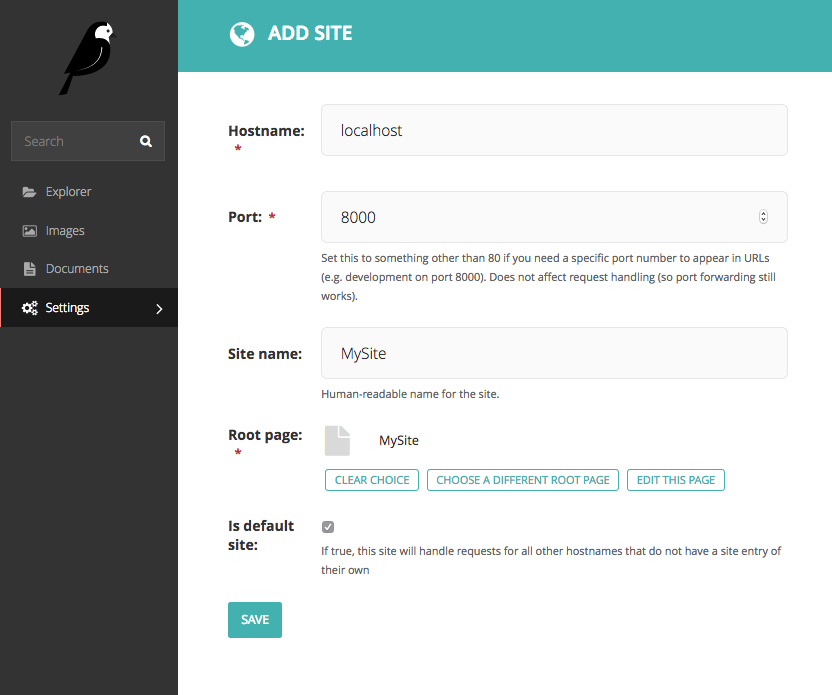

.. _getting_started:

===============
Getting started
===============

To start using wagtailtrans in your project, take the following steps:

------------
Installation
------------

1. Install Wagtailtrans via ``pip``

.. code-block:: bash

    $ pip install wagtailtrans

2. Add ``wagtailtrans``, ``wagtail.contrib.modeladmin`` and if you're using languages per site ``wagtail.contrib.settings`` to your ``INSTALLED_APPS``::

.. code-block:: python

    INSTALLED_APPS = [
        # ...
        'wagtail.contrib.modeladmin',
        'wagtail.contrib.settings',  # Only required when WAGTAILTRANS_LANGUAGES_PER_SITE=True
        'wagtailtrans',
        # ...
    ]

.. note::

    As of Wagtailtrans 1.0.3 the custom Language management views are replaced with with ``wagtail.contrib.modeladmin``
    This needs to be added to ``INSTALLED_APPS`` as well.

3. Add ``wagtailtrans.middleware.TranslationMiddleware`` to your ``MIDDLEWARE``::

.. code-block:: python

    MIDDLEWARE = [
        # ...
        'django.contrib.sessions.middleware.SessionMiddleware',
        'wagtail.core.middleware.SiteMiddleware',
        'wagtailtrans.middleware.TranslationMiddleware',
        'django.middleware.common.CommonMiddleware',
        # ...
    ]

.. note::

    Keep in mind ``wagtailtrans.middleware.TranslationMiddleware`` is a replacement for ``django.middleware.locale.LocaleMiddleware``.

.. note::

    It relies on ``wagtail.core.middleware.SiteMiddleware``, which should come before it.
    See http://docs.wagtail.io/en/latest/getting_started/integrating_into_django.html#settings for more information.

-------------
Configuration
-------------

Before we start incorporating wagtailtrans in your project, you'll need to configure wagtailtrans for the behavior that best suits the need of your project. The required settings to consider here are:

 - ``WAGTAILTRANS_SYNC_TREE``
 - ``WAGTAILTRANS_LANGUAGES_PER_SITE``

Both settings are mandatory but provided with a default value, so if you want *synchronized* trees and no languages per site, you're good to go from here.

.. seealso::
    Complete reference about available settings: :ref:`settings`

-------------
Incorporating
-------------

To start using wagtailtrans we first need to create a translation home page. This page will route the requests to the homepage in the right language. We can create a translation site root page by creating the ``wagtailtrans.models.TranslatableSiteRootPage`` as the first page under the root page.

In this example we will also make a ``HomePage`` which will be translatable. This is done by implementing the ``wagtailtrans.models.TranslatablePage`` instead of Wagtail's ``Page``

.. code-block:: python

    from wagtailtrans.models import TranslatablePage

    class HomePage(TranslatablePage):
        body = RichTextField(blank=True, default="")
        image = models.ForeignKey('wagtailimages.Image', null=True, blank=True, on_delete=models.SET_NULL, related_name='+')

        content_panels = Page.content_panels + [
            FieldPanel('body'),
            ImageChooserPanel('image')
        ]

        subpage_types = [
            # Your subpage types.
        ]

This will create our first translatable page. To start using it we first need to migrate our database

.. code-block:: bash

    $ python manage.py makemigrations
    $ python manage.py migrate

Now run the server and under the page ``Root`` create a ``TranslatableSiteRootPage`` (MySite).

Next we need to create a site and point it's ``root_page`` to our ``TranslatableSiteRootPage`` (MySite).

We now have the basics for a Translatable Site.
