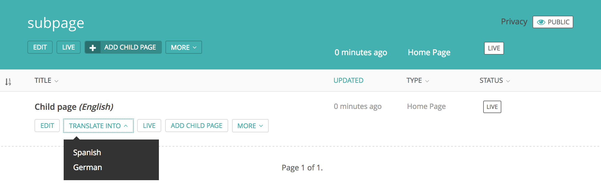

.. _freeform_trees:

==========================
Freeform translation trees
==========================

Before you can start using freeform trees, please be sure you followed all the steps in: :ref:`getting_started`.

If you specified the ``WAGTAILTRANS_SYNC_TREE`` in your settings as ``False`` you will be using the freeform trees. the freeform trees are used if you do not want to keep your language trees the same for all languages. This enables the *translate into* button in the Wagtail admin. This will show all the languages that the page can be translated into.

- Once a language is selected you will be asked if you want to copy the content and where to move the page to.
- With this setting your page tree structure is free for all languages.
- The translator roles and groups will still be created as in the synchronized tree section.
