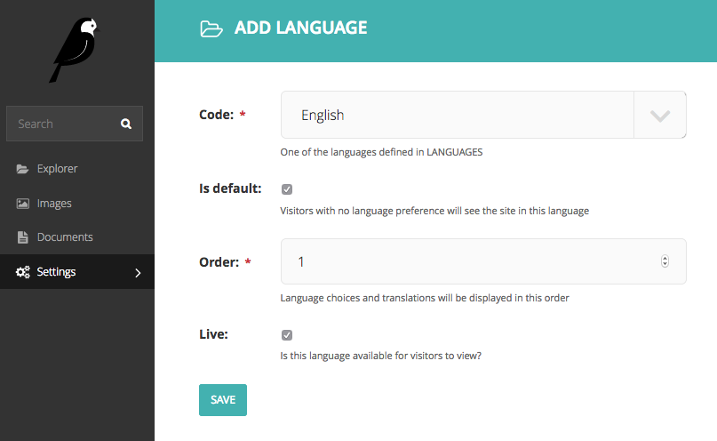
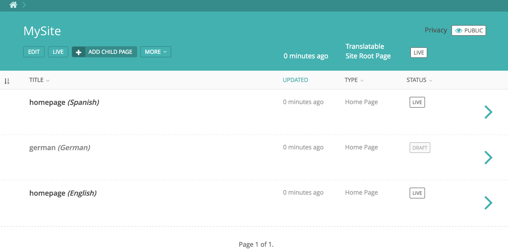

.. _synchronized_trees:

==============================
Synchronized translation trees
==============================

Before you can start using syncronized trees, please be sure you followed all steps in: :ref:`getting_started`.

If you specified the `WAGTAILTRANS_SYNC_TREE` In your settings as `True` you will be using the syncronized trees.
This means that every change in your 'canonical' tree will also be done in the translated trees.
To start using this we first need to create a default language (canonical).
In your wagtail admin page in settings, select languages.

    We will be using English as our default language. Please do Note thant only *ONE* default language can be used

Add any other language you will be using in your site but don't check `is default`.
for demonstration purposes we add German and Spanish.

Now we go to out site root page (MySite) and create a new page. called `Homepage`
after saving the Homepage copies of this page will be saved for each language. This will happen for every
`TranslatablePage` instance created when `WAGTAILTRANS_SYNC_TREE = True`.
This way language trees will always be synchronized.

With the creation of a language a new translator user group is created. This group will gain
edit and publish permissions on each page with corresponding language.

Now any change made in the canonical tree will also be made in the translation trees.
